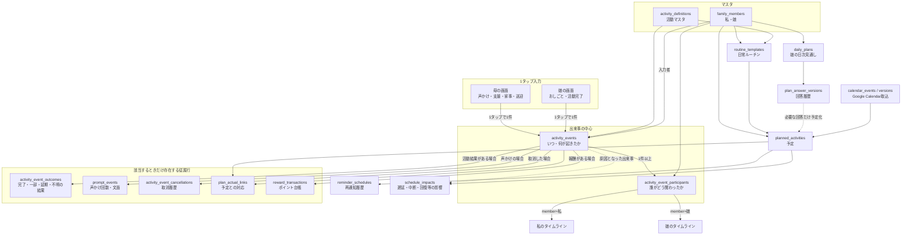

# くらしリレー
## データモデル設計（現在の正）

更新日: 2026-07-19

この文書は、現在のDBと今後の統合先を示す恒久ドキュメントである。
実装手順は `docs/wip/database-unification/implementation-plan.md`、設計判断は
`docs/design-decisions.md` の DR-023 / DR-024 / DR-027 を参照する。

## 1. 前提

- くらしリレーは**我が家専用の単一家庭システム**として運用する。
- 複数家庭・SaaS化は対象外。全テーブルへの `household_id` 追加は行わない。
- 人物の区別には既存の `family_members` を使用する。
- 母・娘以外の家族を追加できる余地は残すが、複数家庭テナント分離は設計しない。
- 通常のスキーマ変更は差分マイグレーションで行う。画面通信方式の切替前はデータが少量なため、DR-031により
  backup/exportとユーザーの実行時明示確認を条件に、管理下のDB refreshを選べる。
- 記録は監視・評価ではなく、支援・待機・回復・役割分担の把握に使う。
- Google Calendarは予定の入力源の1つとして扱い、Calendar側を実績の正本にはしない。

## 2. 現在のスキーマ

現在は次の3系統に分かれており、系統間の外部キーはない。

### 2.1 おしごと・ポイント・ごほうび

- `family_members`
- `task_definitions`
- `task_records`
- `task_record_operations`
- `reward_collections`
- `reward_adjustments`

### 2.2 声かけ・日次タスク・リマインダー

- `routine_templates`
- `prompt_templates`
- `daily_tasks`
- `prompt_events`
- `completion_events`
- `reminder_schedules`

### 2.3 娘の見通し・予定・振り返り

- `daily_plans`
- `plan_items`
- `reflection_sessions`

主な問題は、同じ「着替え」「宿題」「入浴」などが `task_definitions` と
`routine_templates` に別々に存在し、完了も `task_records` と `completion_events` に
別々に保存されることである。

## 3. 統合後の全体像

統合の中心は次の3層とする。

1. `activity_definitions`: 何の活動か
2. `activity_events`: いつ、何が起きたか
3. `activity_event_participants`: 誰が、どの役割で関わったか

`planned_activities` は予定の正本だが、実際の出来事に対する任意の文脈であり、
`plan_actual_links` が存在するときだけ関連付ける。
声かけは `activity_events` に共通ヘッダーを記録し、回数・文面等の固有情報だけを
`prompt_events` に1対1で記録する。活動結果・取消も該当時だけ従属行を作る。
ポイントは出来事そのものへ持たせず、`reward_transactions` から導出する。

## 4. 人物

### 4.1 `family_members`（既存・継続）

我が家の人物。単一家庭のため `household_id` は持たない。

- id
- role: `mother | child | family | supporter`
- display_name
- is_active
- created_at
- updated_at

制約:

- `role` は現在の母・娘について一意を維持する。
- 将来同じ役割の人物を複数登録する場合は、`role` の一意制約を外し `member_key` を追加する。
- 履歴から参照されている人物は物理削除せず `is_active=false` とする。

## 5. 活動マスタ

### 5.1 `activity_definitions`（新規）

「着替え」「宿題」「入浴」など、3系統で共有する活動の意味を1か所にまとめる。

- id
- activity_key: `ACT-xxx`
- category
- name
- child_label
- parent_prompt_label
- quick_label
- kind: `activity | support | waiting | recovery | sleep`
- is_active
- created_at
- updated_at

制約:

- `activity_key` UNIQUE
- `kind` CHECK
- 過去実績から参照されている活動は物理削除せず無効化する。

### 5.2 既存マスタとの関係

- `task_definitions` に `activity_definition_id` を追加し、ポイント対象としての設定だけを残す。
- `routine_templates` に `activity_definition_id` を追加し、時間帯・時刻・表示条件だけを残す。
- `activity_key` と3種類のラベルの正本は `activity_definitions` とする。
- 移行完了後、重複する名称・ラベル列は必要なスナップショットを除いて廃止する。

## 6. 予定

### 6.1 `planned_activities`（新規）

ルーチン、娘の見通し、手入力、Google Calendarを共通形式の予定に変換する。

- id
- subject_member_id FK -> family_members
- activity_definition_id FK nullable
- source_type: `routine | child_plan | manual | google_calendar`
- source_key
- title_snapshot
- category_snapshot
- planned_start_at nullable
- planned_end_at nullable
- is_all_day
- local_date
- status: `planned | changed | cancelled`
- routine_template_id FK nullable
- plan_answer_version_id FK nullable
- calendar_event_version_id FK nullable
- created_at
- updated_at

制約:

- UNIQUE (`source_type`, `source_key`)
- `planned_end_at IS NULL OR planned_end_at >= planned_start_at`
- 予定元FKは `source_type` と整合することをアプリ層とテストで保証する。
- Google Calendarの更新・削除で物理削除せず、版または取消状態を残す。

### 6.2 `routine_templates`（既存・変更）

活動そのものではなく、日常のどの枠に出すかを定義する。

- id
- slug
- activity_definition_id FK
- subject_member_id FK
- phase: `morning | evening | night | anytime`
- default_time nullable
- daily_limit nullable
- display_rule nullable
- sort_order
- is_active
- created_at
- updated_at

制約:

- `slug` UNIQUE
- `slug` は表示名と独立した安定キーとし、Seederのupsertキーにも使用する。
- `daily_limit IS NULL OR daily_limit > 0`
- `sort_order >= 0`

### 6.3 `daily_tasks`（移行期間中に継続）

統合移行中は既存API互換のため残す。最終的には `planned_activities` が日次予定の正本になる。

- `planned_activity_id` を追加して1対1で関連付ける。
- `phase`、`name`、`icon`、`scheduled_at` は当時表示された内容のスナップショットとして残してよい。
- `status`、`prompt_count`、`latest_prompt_at` は正本にしない。

## 7. 出来事・人物参加・活動結果

### 7.1 `activity_events`（新規・出来事の正本）

母のクイック記録、娘のおしごと、声かけ、支援、家事など、実際に起きたことを
「いつ・何が起きたか」という共通ヘッダーで記録する。人物の役割、活動結果、予定との対応、
取消は本体へnullable列を追加せず、該当するときだけ従属行を作る。

- id
- activity_definition_id FK -> activity_definitions
- event_type: `activity | prompt | support`
- occurred_at
- recorded_by_member_id FK -> family_members
- source: `mother_quick | daughter_task | oshigoto | koekake | manual | import`
- idempotency_key
- created_at
- updated_at

制約:

- 上記の業務列は全て NOT NULL
- `event_type` CHECK
- `idempotency_key` UNIQUE
- 1イベントの作成時に、少なくとも1件の `activity_event_participants` を同一トランザクションで追加する。
- 1タップは1イベントとし、連打した回数だけ別イベントを追記する。
- 記録済みイベントを物理削除・業務内容の上書きで訂正しない。

### 7.2 `activity_event_participants`（新規・人物参加の正本）

1つの出来事に誰がどの役割で関わったかを記録する。同じ出来事を母用・娘用に複製せず、
参加行を基準に両方のタイムラインへ表示する。

- id
- activity_event_id FK -> activity_events
- family_member_id FK -> family_members
- role: `actor | supporter | target`
- created_at

制約:

- 全列 NOT NULL
- `role` CHECK
- UNIQUE (`activity_event_id`, `family_member_id`, `role`)
- 各イベントに `actor` を1件以上持つことをアプリ層とテストで保証する。
- `recorded_by_member_id` はアプリへ入力した人、参加行は生活上で関わった人として区別する。

代表例:

| 出来事 | `event_type` | 参加者 |
|---|---|---|
| 母が娘へ起床の声かけ | `prompt` | 母=`actor`、娘=`target` |
| 母が娘の持ち物準備を支援 | `support` | 母=`actor`、娘=`target` |
| 娘が持ち物を確認 | `activity` | 娘=`actor` |
| 娘が準備し、母が同時に支援 | `activity` | 娘=`actor`、母=`supporter` |
| 母が家事を実施 | `activity` | 母=`actor` |

画面操作からの自動付与はDR-032と
`docs/wip/database-unification/implementation-plan.md` の「8.1 Gate 1確定事項」を正とする。
`recorded_by_member_id` と人物参加は同一人物とは限らず、母が娘の完了を入力する場合は
母=`recorded_by`、娘=`actor` とする。

### 7.3 `activity_event_outcomes`（新規・活動結果）

完了・一部・延期等の結果があるイベントにだけ1行作る。声かけや支援を記録しただけの場合は
結果行を作らず、`activity_events.result=NULL` のような表現はしない。

- activity_event_id PK / FK -> activity_events
- result: `completed | partial | deferred | unknown`
- created_at

制約:

- 全列 NOT NULL
- `result` CHECK
- `activity_events.event_type='activity'` との整合をアプリ層とテストで保証する。
- 「一緒にした」「母が代行した」は結果値にせず、参加者の役割から表現する。
- `deferred` / `unknown` は娘の予定活動について母が状態を入力した結果であり、娘=`actor`、
  母=`recorded_by` とする。`completed` と区別し、活動が完了した事実として集計しない。

### 7.4 `activity_event_cancellations`（新規・取消履歴）

取消時だけ1行を追加し、元イベントと参加行・固有情報を削除しない。

- activity_event_id PK / FK -> activity_events
- cancelled_at
- cancelled_by_member_id FK -> family_members
- created_at

制約:

- 全列 NOT NULL
- `cancelled_at >= activity_events.occurred_at`
- 取消済みイベントは通常集計から除外するが、履歴画面では復元可能にする。

### 7.5 訂正と任意メモ

- 訂正は元イベントを取り消して新しいイベントを追記し、両方を履歴に残す。
- 任意メモが必要になった場合は `activity_event_notes` の従属行として追加し、
  出来事ヘッダーへnullable `note` 列を置かない。

### 7.6 既存記録テーブルの移行

DR-031により、画面通信方式の切替前の標準経路はtarget schemaを作成してrefreshする経路とする。
次のbackfill・互換処理は、既存データを保持する判断をした場合の代替経路として残す。

- `task_records` は `activity_events`、`activity_event_participants`、必要な結果・報酬行へバックフィルする。
- `completion_events` は `activity_events`、参加行、`activity_event_outcomes` へバックフィルする。
- 既存 `prompt_events` は次節の固有情報を残し、各行に対応する `activity_events` と参加行を作る。
- 過去データで入力者・実行者を直接保持していないものは、既存画面の利用者と状態値から移行規則を明示して補完し、
  `source='import'` で推定移行であることを識別できるようにする。
- 新規書き込みを共通イベントへ切り替えた後、旧APIは互換アダプターとして残す。
- 比較期間を設け、件数・日時・ポイント集計が一致してから旧テーブルへの書き込みを停止する。
- 旧テーブルの削除は別フェーズとし、同じリリースで行わない。

## 8. 声かけとリマインダー

### 8.1 `prompt_events`（既存・声かけ固有情報へ変更）

声かけも実際に起きた出来事なので、共通情報と人物参加は `activity_events` /
`activity_event_participants` を正本とする。`prompt_events` は声かけにだけ必要な情報を1対1で保持する。

- activity_event_id PK / FK -> activity_events
- prompt_order
- prompt_text
- prompt_level
- created_at

制約:

- 全列 NOT NULL
- `prompt_order > 0`
- `prompt_level BETWEEN 1 AND 3`
- `activity_events.event_type='prompt'` との整合をアプリ層とテストで保証する。
- 1回目・2回目・3回目はそれぞれ別の `activity_events` / `prompt_events` として追記する。
- `prompt_order` は予定または対象活動ごとに数える。起床5回・着替え3回なら合計8イベントとなる。
- 日時・入力者・冪等キーは `activity_events`、声をかけた人・対象者は参加行、取消は
  `activity_event_cancellations` を正本とする。
- `prompt_count` は非取消の `event_type='prompt'` イベント件数から導出する。
- `latest_prompt_at` は同イベントの `occurred_at` 最大値から導出する。

移行期間中は既存列と `daily_task_id` を互換用に残してよいが、新しい正本への書き込み・比較完了後に廃止する。

### 8.2 `prompt_templates`（既存・強化）

- UNIQUE (`routine_template_id`, `prompt_level`, `sort_order`)
- `prompt_level BETWEEN 1 AND 3`
- 優先文を1レベル1件に制限する場合は部分ユニーク制約を追加する。

### 8.3 `reminder_schedules`（既存・履歴保持）

- `status`: `scheduled | fired | cancelled`
- `fired_at` nullable
- `cancelled_at` nullable
- 同じ日次予定に有効な `scheduled` は1件だけとする部分ユニーク制約を追加する。
- 再通知変更時は既存行を削除せず取消にし、新しい行を追加する。

## 9. 娘の見通しと回答履歴

### 9.1 `daily_plans`（既存・変更）

- id
- subject_member_id FK -> family_members
- plan_date
- mode
- created_at
- updated_at

制約:

- UNIQUE (`subject_member_id`, `plan_date`)
- 単一の娘しかいない間も人物FKを明示する。
- `review_completed_at` は `reflection_sessions` から導出し、正本にしない。

### 9.2 `plan_questions`（新規）

質問カードを追加してもマイグレーションが不要な構造にする。

- id
- question_key
- label
- answer_type: `text | multi_select | choice | time | boolean`
- mode_rule nullable
- activity_definition_id FK nullable
- sort_order
- is_active

制約:

- `question_key` UNIQUE
- `sort_order >= 0`

### 9.3 `plan_answer_versions`（新規・履歴の正本）

回答の置換・削除をせず、変更のたびに新しい版を追加する。

- id
- daily_plan_id FK
- question_id FK
- version_no
- value_json
- decided_with_member_id FK nullable
- recorded_by_member_id FK nullable
- recorded_at
- supersedes_version_id FK nullable
- created_at

制約:

- UNIQUE (`daily_plan_id`, `question_id`, `version_no`)
- `version_no > 0`
- 最新回答は最大 `version_no` から導出する。
- 「今は決めない」を記録する必要が生じた場合も回答種別または明示イベントとして追加できる。

### 9.4 `plan_items` の移行

- 既存 `plan_items` と `wake_up_time` / `school_start_period` を回答版へバックフィルする。
- 現行APIレスポンスは最新回答から従来形式へ組み立てる。
- 移行完了まで `plan_items` を互換テーブルとして残す。

### 9.5 `reflection_sessions`（既存・履歴化）

- `daily_plan_id` UNIQUEを廃止し、複数回の振り返りを追記できるようにする。
- `revision_no` を追加し UNIQUE (`daily_plan_id`, `revision_no`)。
- `recorded_by_member_id` を追加する。
- 完了後の訂正は既存行を上書きせず新しい版を追加する。
- `daily_plans.review_completed_at` は最新の完了セッションから導出する。

## 10. ポイント・ごほうび

### 10.1 `reward_rules`（新規）

活動とポイント・コイン・ごほうび条件を分離する。

- id
- activity_definition_id FK nullable
- member_id FK
- reward_kind: `gauge | coin | point | collection`
- amount
- valid_from nullable
- valid_until nullable
- is_active

### 10.2 `reward_transactions`（新規・台帳の正本）

- id
- member_id FK
- activity_event_id FK nullable
- reward_rule_id FK nullable
- transaction_type: `earn | adjustment | reversal`
- kind: `gauge | coin | point`
- amount
- occurred_at
- idempotency_key
- reverses_transaction_id FK nullable
- reason nullable

制約:

- `idempotency_key` UNIQUE
- `amount <> 0`
- 通常付与は UNIQUE (`activity_event_id`, `reward_rule_id`, `transaction_type`)
- 訂正は更新・削除せず反対符号の `reversal` を追加する。

### 10.3 `reward_collections`（既存・変更）

- `reward_program_key` を追加し、将来テーマやシーズンを分けられるようにする。
- UNIQUE (`family_member_id`, `reward_program_key`, `milestone_number`)
- 1つの実績を獲得契機1件に限定する場合、`activity_event_id` に部分ユニーク制約を追加する。

## 11. Google Calendar

### 11.1 `calendar_connections`（新規）

- id
- provider: `google`
- external_calendar_id
- provider_account_id
- display_name
- timezone
- refresh_token_encrypted nullable
- sync_token_encrypted nullable
- token_expires_at nullable
- is_active
- last_synced_at nullable

制約:

- UNIQUE (`provider`, `external_calendar_id`)
- OAuthトークン・同期トークンは平文保存しない。

### 11.2 `calendar_events`（新規・外部IDの軸）

- id
- calendar_connection_id FK
- external_event_id
- created_at
- updated_at

制約:

- UNIQUE (`calendar_connection_id`, `external_event_id`)

### 11.3 `calendar_event_versions`（新規・取込履歴）

- id
- calendar_event_id FK
- version_no
- provider_updated_at
- status
- title
- start_at nullable
- end_at nullable
- is_all_day
- location nullable
- description nullable
- raw_payload nullable
- imported_at

制約:

- UNIQUE (`calendar_event_id`, `version_no`)
- UNIQUE (`calendar_event_id`, `provider_updated_at`) は同一時刻更新が保証される場合のみ採用する。
- Calendar側の取消・削除も版として残す。

最新のCalendar版から `planned_activities` を作成・更新する。Calendarの内容を直接
`activity_events` へ保存しない。

## 12. 予定と出来事の突き合わせ

### 12.1 `plan_actual_links`（新規）

予定と出来事は1対1とは限らないため、中間テーブルで関連付ける。
同じ持ち物準備予定に、7時の母の支援と7時30分の娘の実施を別イベントとして接続できる。
予定と無関係な出来事ではリンク行を作らず、出来事本体にnullable予定FKを持たせない。

- id
- planned_activity_id FK
- activity_event_id FK
- link_type: `primary | prompt | support | partial | interruption | cause`
- matched_by: `automatic | manual`
- confidence
- created_at

制約:

- UNIQUE (`planned_activity_id`, `activity_event_id`, `link_type`)
- `confidence BETWEEN 0 AND 100`
- 手動対応は `confidence=100` とする。

### 12.2 `schedule_impacts`（新規）

- id
- planned_activity_id FK
- cause_activity_event_id FK nullable
- impact_type: `delayed | shortened | interrupted | cancelled | postponed | moved_to_night | changed_to_support | changed_to_recovery`
- lost_minutes nullable
- interruption_count nullable
- actual_return_at nullable
- note nullable
- created_at

制約:

- `lost_minutes IS NULL OR lost_minutes >= 0`
- `interruption_count IS NULL OR interruption_count >= 0`

## 13. 派生値の扱い

### 削除または非正本化する値

| 現在の列 | 正本 | 方針 |
|---|---|---|
| `daily_tasks.prompt_count` | 非取消の `event_type='prompt'` イベント件数 | APIで集計。移行後に列削除 |
| `daily_tasks.latest_prompt_at` | 同イベントの `activity_events.occurred_at` 最大値 | APIで集計。移行後に列削除 |
| `daily_tasks.status` | 予定に対応する最新の有効な `activity_event_outcomes.result` | APIで導出。移行後に列削除 |
| `daily_plans.review_completed_at` | 最新の完了 `reflection_sessions.completed_at` | APIで導出。移行後に列削除 |

次は履歴スナップショットなので残す。

- `task_records.granted_point_value`: 完了時点単価
- 日次予定の表示名・時刻: その日に見えていた内容
- Calendarイベントの版ごとのタイトル・時刻

性能上キャッシュが必要になった場合は、正本から再構築できる列またはマテリアライズドビューとして追加し、
正本扱いしない。再構築コマンドと整合性テストを同時に実装する。

## 14. DB制約の共通方針

- 変更しやすさを優先し、PostgreSQLのネイティブENUMではなく `string + CHECK` を使う。
- 必須値は `NOT NULL`。
- 常に存在しない役割・結果・予定対応・取消はnullable列で表さず、必要な場合だけ従属行を追加する。
- `activity_events` は必須の出来事ヘッダーだけを持ち、人物参加・結果・声かけ・取消・予定対応の正本を重複させない。
- 数値範囲・日時順序・状態値をCHECK制約で守る。
- 外部キー削除動作を全て明示する。
  - マスタ・履歴: `RESTRICT`
  - 一時的な従属データ: 必要な場合のみ `CASCADE`
- 記録・履歴・台帳は物理削除しない。
- 一意制約追加前に重複監査SQLを実行し、重複があれば先に修復する。
- 既存CREATEマイグレーションは変更せず、差分ALTERを追加する。

## 15. APIアクセス保護

単一家庭でも、本番APIが公開URLにある以上、家庭数とは無関係にアクセス保護が必要である。
ただし複数ユーザー認証は不要なため、当面は家族共有トークン方式とする。

- 環境変数 `FAMILY_TOKEN` をLaravel側だけに保存する。
- `/api/health` 以外の取得・更新APIを `X-Family-Token` ミドルウェアで保護する。
- トークンはフロントのソースやビルド時環境変数へ埋め込まない。
- 初回に利用者が「あいことば」を入力し、端末側へ保存する。
- 比較は `hash_equals`、失敗は401、連続失敗にはRate Limitを適用する。
- トークンは環境変数差し替えでローテーション可能にする。
- 本番で `FAMILY_TOKEN` が未設定の場合は保護を無効化せず、起動失敗または保護APIを503にする（fail closed）。
- API-first SPA移行後も通常画面は `/api/*` を利用する。認証方式の見直しは
  `docs/wip/api-first-spa-migration/implementation-plan.md` のPhase A3で決定する。

## 16. 実装順

実際の移行順、バックフィル、互換期間、検証条件は
`docs/wip/database-unification/implementation-plan.md` を正とする。同計画は2026-07-19にDR-027〜DR-032へ同期済みである。
今後同計画と本書が矛盾した場合は、最新のDRと本書を先に更新してから実装する。
現在はPhase C/D1/Eのtarget schemaとmigration/seed確認を完了後、本番安定観測を待たず
API-first SPA移行(A0〜A7)へ進む(DR-034)。
