# 完成までの実装計画（Product Phase 1 + F + 2）

更新日: 2026-07-21  
正本の進捗表示: [docs/development-plan.md](../../development-plan.md)  
Cursor 計画ファイル（作業用）: `.cursor/plans/完成までの実装計画_*.plan.md`（リポジトリ外のこともある）

> この文書は進行中メモ（`docs/wip/`）。完了後は `docs/archive/` へ移し、恒久の状態は development-plan / DR に蒸留する。

---

## いまの状況（2026-07-21 時点）

### 結論

**計画の本体実装は PR に乗っているが、本番 `main` にはまだ全部入っていない。**  
次のアクションは **#85 のレビューとマージ**（#84 は #85 に含まれるためクローズ可）。

### ブランチ / PR

| 状態 | PR / ブランチ | 内容 |
|---|---|---|
| **main 済み** | [#82](https://github.com/toutetu/kurashi-relay/pull/82) | Wave 0: 家族トークン DR-042・恒久文書同期 |
| **main 済み** | [#83](https://github.com/toutetu/kurashi-relay/pull/83) | P1-1: 予定 CRUD API + `/schedule` |
| **OPEN・重複気味** | [#84](https://github.com/toutetu/kurashi-relay/pull/84) `feat/dashboard-from-plans` | P1-2 のみ。#85 に含まれる |
| **OPEN・本命** | [#85](https://github.com/toutetu/kurashi-relay/pull/85) `feat/product-phase-completion` | P1-2〜P1-7 + F-2 + Phase 2 最小スタブ |

### 進捗サマリ

| 項目 | 状態 |
|---|---|
| Wave 0 文書（DR-042） | main 済み |
| P1-1 予定 CRUD | main 済み |
| P1-2〜P1-7 / F-2 / P2 スタブ | **#85 未マージ** |
| F-1 派生列 DROP（`prompt_count` 等） | **未着手**（読取集計は既存。破壊的 ALTER は別PR） |
| P2 本実装（OAuth・通知配信・PDF本文） | **スタブのみ**（#85） |
| Final Cleanup（14日観測後の削除） | **運用待ち** |
| ops: 夏休み `migrate:status` / 娘実端末確認 | **運用残り**（開発は止めない） |

### 作業ツリー注意

- `feat/product-phase-completion` は Cursor worktree  
  `C:/Users/r0110/.cursor/worktrees/phase12-1d93fe06` でも参照されていることがある。
- ローカル `feat/dashboard-from-plans` が origin より ahead になっている場合は、#85 側を正とし #84 を閉じる。

---

## 完成の定義

[docs/product-plan.md](../../product-plan.md) の核心ループが、実データで一通り回ること。

```text
記録 → 予定と実績の差 → 支援・待機・回復の整理 → 支援者へ必要な範囲だけ説明 → 次の担当を決める
```

加えて Phase 2 で外部予定・通知・配布手段まで揃える。

| 含める | 含めない（当面） |
|---|---|
| 母の予定CRUD、ホーム実データ化、待機・回復記録、突き合わせ、支援引き継ぎ、レポートMVP、設定拡充 | ラストウォー詳細の外部出力、図鑑/USJの本保存 |
| Phase F（キャッシュ除去・`reward_transactions` 切替） | 支援者の個別ログイン/権限（共有は期限付きURL） |
| Google Calendar、自動対応候補、端末通知、PDF・共有URL | 旧Render完全削除の強制（観測後の Final Cleanup） |

デザインは現行 B案v3（[design-principles.md](../../design-principles.md) / [ui-redesign-spec.md](../../ui-redesign-spec.md)）を維持。  
情報源は「娘の発言 / 母の確認 / 母の観察 / 母の推測」を混同しない。

---

## 出発時点のギャップ（計画作成時）

- ホーム・予定比較・まとめ: `DashboardFixture` 固定。書込はローカル state。
- 記録タイムライン・おしごと・声かけ・むすめ計画: 実API済み。
- `planned_activities` / `plan_actual_links` あり。母向け予定CRUD・比較APIなし。
- `schedule_impacts`・Calendar 系: 未作成。
- 支援・レポート: Placeholder のみ。
- 報酬: `reward_transactions` スキーマのみ。

```mermaid
flowchart LR
  subgraph done [完了済み基盤]
    Auth[家族トークン DR-042]
    AE[activity_events書込]
    Musume[むすめ計画API]
    SPA[同一オリジンSPA]
  end
  subgraph pp1 [Product Phase 1]
    PlanCRUD[母の予定CRUD]
    HomeAPI[ダッシュボード実データ]
    WaitRec[待機回復記録]
    Compare[予定と実績比較]
    Handover[支援引き継ぎ]
    Report[レポートMVP]
  end
  subgraph pf [Phase F]
    Cache[派生キャッシュ除去]
    Ledger[reward_transactions切替]
  end
  subgraph pp2 [Product Phase 2]
    GCal[Google Calendar]
    AutoMatch[自動対応候補]
    Push[端末通知]
    PdfShare[PDF共有URL]
  end
  done --> pp1 --> pf --> pp2
```



---

## 進め方の共通ルール

- **1機能 = 1ブランチ = 1PR**（`<type>/<domain>-<topic>`）。最新 `main` から切る。
- docs とコードを混ぜない。スキーマ判断は先に短い DR → data-model / api-contract / development-plan。
- 完了条件は対象画面の操作1回、または代表 `curl` 1本（`X-Family-Token` 必須）。
- 高リスク変更だけ独立レビュー1周。
- UIは既存トークン・共通コンポーネント。人物イラストなし。色だけで状態を表さない。

---

## Wave 0: 文書と運用

1. family-token / DR-042 同期 → **完了（#82）**
2. [ops/musume-summer-release.md](../../ops/musume-summer-release.md) 残確認は運用（開発は止めない）
3. Phase B 本番監査は読取確認のみ。NOT NULL 締めは別PR

---

## Wave 1: Product Phase 1

### P1-1 母の予定 API + `/schedule` — **main 済み（#83）**

- `planned_activities`（`source_type=manual`）正本
- `GET/POST/PATCH/DELETE /api/planned-activities`
- `/schedule` 画面。`child_plan` は参照のみ

### P1-2 ダッシュボード実データ化 — **#85 に含む（#84 重複）**

- `DashboardService` を fixture から切替
- `nextPlans` ← `planned_activities`

### P1-3 ホーム記録の永続化 — **#85**

- `/api/home/events`・conditions・quick-logs
- クイックログ UI 接続

### P1-4 予定と実績の比較 — **#85**

- `schedule_impacts` migration
- `/api/schedule-comparisons`
- `ScheduleComparisonPage` 実データ化

### P1-5 支援引き継ぎ — **#85**

- `support_handovers` + `/support`（DR-043）

### P1-6 支援者レポート MVP — **#85**

- `report_snapshots` + `/reports`（ラストウォー除外）

### P1-7 設定拡充 — **#85**

- `family_settings`（日種別など）+ SettingsPage

**Wave 1 完了条件**: 実予定・実出来事から差が見え、引き継ぎを追跡でき、レポートにラストウォーが混ざらない。

---

## Wave 2: Phase F

### F-1 派生キャッシュ除去 — **残り**

- `prompt_count` / `latest_prompt_at` / `daily_tasks.status` / `review_completed_at` を API 集計へ
- 参照0件確認後、差分 ALTER で列削除（**別PR推奨**）

### F-2 `reward_transactions` 台帳 — **#85（書込開始）**

- おしごと完了/取消で `earn` / `reversal`
- 読取の台帳一本化・旧経路削除は移行観測後

---

## Wave 3: Product Phase 2

### P2-1 Google Calendar — **#85 はスタブ**

- テーブル + display_name 登録。OAuth・増分同期は未

### P2-2 自動対応候補 — **#85 は候補POSTまで**

- 確定扱いにしない。採用/却下 UI の本仕上げは続き

### P2-3 端末通知 — **#85 は購読登録のみ**

- 配信・オプトイン本実装は続き

### P2-4 PDF・共有URL — **#85 は共有トークン + 公開GET**

- PDF 本文生成は未

---

## Wave 4: Final Cleanup

- 旧列・旧API・旧Render の14日ゼロ利用後に個別削除
- `DashboardFixture` 削除（非使用化は #85 で進行）
- 本 WIP を archive へ移す

---

## 推奨リリース順（実績つき）

1. ~~docs: family-token / DR-042~~ → #82
2. ~~`feat/planned-activities`~~ → #83
3. **`feat/product-phase-completion`** → **#85（マージ待ち）** ※ #84 はクローズ可
4. `refactor/phase-f-derived-cache`（F-1 列削除）
5. `feat/google-calendar-oauth`（本接続）
6. `feat/plan-actual-match-ui`（候補の採用/却下）
7. `feat/web-push-delivery`
8. `feat/report-pdf`
9. `chore/final-cleanup-*`

---

## 次にやること（短いチェックリスト）

1. [ ] #85 をレビューし、動作確認1回（予定追加→ホーム→比較→支援→レポート→設定）
2. [ ] #85 を main へマージ（ユーザー確認後）
3. [ ] #84 をクローズ
4. [ ] 本番で新 migration 適用（差分 `migrate --force`。fresh 禁止）
5. [ ] F-1 / P2 本実装を上の順で別PR
6. [ ] 本WIPを完了時に archive へ移す

---

## リスクと先送り

- 高速連打・日跨ぎ等（DR-028 バックログ）は完成後
- Phase B の NOT NULL 締めは本番件数監査後
- 支援者アカウント本実装は共有URLの利用状況を見てから
